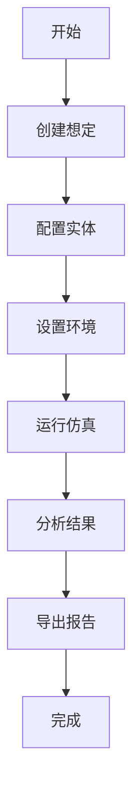

# 贡献指南

感谢您考虑为电子战对抗仿真系统做出贡献！本指南将帮助您了解如何参与项目开发。

## 行为准则

请阅读我们的CODE_OF_CONDUCT.md，我们希望所有贡献者都能遵守。

## 如何贡献

### 报告问题
如果您发现了bug或有功能建议：
1. 在GitHub Issues中搜索是否已有相关问题
2. 如果没有，创建新的issue
3. 清晰描述问题或建议
4. 提供复现步骤（如果是bug）

### 贡献代码
1. Fork项目仓库
2. 创建功能分支
3. 编写代码和测试
4. 提交更改
5. 创建Pull Request

### 改进文档
- 修复拼写错误
- 改进文档结构
- 添加示例代码
- 翻译文档

### 回答问题
- 在Issue中回答问题
- 在讨论区帮助他人
- 分享使用经验

## 开发环境设置

### 环境要求
- Python 3.8+
- Git
- Docker（可选）

### 设置步骤
```bash
# 1. 克隆仓库
git clone https://github.com/yourusername/ew-combat-system.git
cd ew-combat-system

# 2. 创建虚拟环境
python -m venv venv
source venv/bin/activate  # Windows: venv\Scripts\activate

# 3. 安装开发依赖
pip install -r requirements-dev.txt
pip install -e .

# 4. 安装预提交钩子
pre-commit install
```

### 代码结构
```
ew-combat-system/
├── src/              # 源代码
├── tests/           # 测试代码
├── docs/            # 文档
├── examples/        # 示例
└── config/          # 配置文件
```

## 编码规范

### Python代码
- 遵循PEP 8规范
- 使用Black格式化
- 使用类型提示
- 编写文档字符串

示例：
```python
def calculate_coverage(radar: Radar, resolution: float = 5.0) -> np.ndarray:
    """
    计算雷达覆盖范围
    
    参数:
        radar: 雷达实体
        resolution: 分辨率(km)
        
    返回:
        覆盖范围网格
        
    异常:
        ValueError: 参数无效时抛出
    """
    if resolution <= 0:
        raise ValueError("分辨率必须大于0")
    # 实现代码
```

### 提交信息
使用约定式提交格式：
```
类型(范围): 描述

详细描述

不兼容变更: 列出不兼容的变更
```

类型包括：
- `feat`: 新功能
- `fix`: 修复bug
- `docs`: 文档更新
- `style`: 代码格式
- `refactor`: 重构
- `test`: 测试相关
- `chore`: 构建过程或辅助工具

### 测试要求
- 新功能必须包含测试
- 测试覆盖率不低于80%
- 包含单元测试和集成测试

运行测试：
```bash
# 运行所有测试
pytest

# 运行特定测试
pytest tests/unit/test_entities.py

# 生成覆盖率报告
pytest --cov=src --cov-report=html
```

## Pull Request流程

### 创建PR
1. 确保分支基于最新的main分支
2. 确保所有测试通过
3. 更新相关文档
4. 描述更改内容
5. 关联相关issue

### PR检查清单
- [ ] 代码符合编码规范
- [ ] 包含必要的测试
- [ ] 测试全部通过
- [ ] 文档已更新
- [ ] 提交信息符合规范
- [ ] 代码评审意见已处理

### 评审流程
1. 自动检查（CI/CD）
2. 代码评审（至少2人）
3. 合并到开发分支
4. 集成测试
5. 发布到生产

## 文档贡献

### 文档结构
```
docs/
├── api/          # API文档
├── guide/        # 用户指南
├── tutorial/     # 教程
└── development/  # 开发文档
```

### 编写要求
- 使用Markdown格式
- 包含代码示例
- 添加截图（如需要）
- 保持更新

## 发布流程

### 版本管理
- 使用语义化版本
- 主版本：不兼容的API更改
- 次版本：向下兼容的功能新增
- 修订版本：向下兼容的问题修正

### 发布步骤
1. 更新版本号
2. 更新CHANGELOG.md
3. 创建发布分支
4. 执行发布脚本
5. 创建GitHub Release
6. 发布到PyPI

## 社区角色

### 贡献者级别
1. **初级贡献者**: 报告问题、修复文档
2. **活跃贡献者**: 修复bug、添加功能
3. **核心贡献者**: 代码评审、项目管理
4. **维护者**: 发布管理、社区领导

### 成为核心贡献者
- 持续贡献6个月以上
- 熟悉项目架构
- 完成重要功能
- 获得现有核心贡献者推荐

## 获取帮助

### 讨论渠道
- GitHub Issues: 问题讨论
- GitHub Discussions: 功能讨论
- Slack频道: 实时交流
- 邮件列表: 开发讨论

### 学习资源
- docs/api/
- docs/tutorial/
- examples/
- docs/development/

## 许可证

贡献代码意味着您同意将您的贡献在MIT许可证下授权。

## 致谢

感谢所有为项目做出贡献的开发者！

---

*本指南根据项目发展会不断更新，请定期查看最新版本。*
EOF

# 创建CODE_OF_CONDUCT.md
cat > CODE_OF_CONDUCT.md << 'EOF'
# 贡献者公约

## 我们的承诺

为了营造一个开放和受欢迎的环境，我们作为贡献者和维护者承诺：无论年龄、体型、身体健全与否、民族、性征、性别认同与表达、经验水平、国籍、个人外观、人种、宗教信仰、性取向，都愿意在我们的项目和社区中，对每一位参与者都表示友好、尊重和不受骚扰的对待。

## 我们的准则

有助于创造积极环境的行为包括但不限于：

* 使用友好和包容性语言
* 尊重不同的观点和经历
* 耐心地接受建设性批评
* 关注对社区最有利的事情
* 友善对待其他社区成员

身为社区成员不应做出的行为包括但不限于：

* 使用与性有关的言语或是图像，以及不受欢迎的性骚扰
* 挑衅、侮辱/贬损的评论，及人身攻击
* 公开或私下的骚扰
* 未经许可地发布他人的个人资料，例如住址、电子邮箱等
* 其他可以被合理地认定为不恰当或者违反职业操守的行为

## 我们的责任

项目维护者有责任为「可接受的行为」标准做出诠释，以及对已发生的不被接受的行为采取恰当且公平的纠正措施。

项目维护者有权利及责任去删除、编辑、拒绝与本行为标准有所违背的评论、提交、代码、wiki编辑、问题等贡献。项目维护者可暂时或永久性地封禁任何他们认为行为不当、威胁、冒犯、有害的参与者。

## 适用范围

本行为标准适用于本项目中的所有场合，以及在本项目中代表社区时的公开场合。

代表社区的情况包括但不限于：使用项目官方电子邮件地址、通过官方社交媒体账号发布消息、在线或线下活动中担任指定代表等。

## 贯彻执行

可以通过 contact@ew-simulation.com 联系项目团队，举报滥用、骚扰或其他不被接受的行为。

维护团队有责任和义务对举报进行保密，并将酌情通知举报人后续进展。

## 处理流程

### 1. 举报
如果您遭遇或目睹不可接受的行为，请立即联系维护团队：
- 邮箱: conduct@ew-simulation.com
- 紧急情况: 通过GitHub Issues报告

### 2. 调查
1. 确认收到举报（24小时内）
2. 收集相关信息
3. 评估情况严重性
4. 决定处理方案

### 3. 处理
根据情况严重性，可能采取以下措施：
1. **警告**: 书面警告，说明违规行为
2. **暂停**: 临时禁止参与项目活动
3. **永久封禁**: 永久禁止参与项目

### 4. 上诉
对处理决定有异议，可以在7天内提出上诉。

## 指导原则

### 建设性批评
- 关注改进而不是指责
- 提供具体建议
- 尊重他人时间和努力
- 私下提供敏感反馈

### 分歧处理
- 保持专业和尊重
- 寻求共同理解
- 必要时寻求调解
- 接受不同观点

### 沟通准则
- 使用清晰简洁的语言
- 避免技术术语（对非技术人员）
- 尊重不同的沟通风格
- 耐心解释复杂概念

## 适用范围例外

本行为准则不适用于：
1. 表达有科学依据的不同意见
2. 基于事实的技术讨论
3. 合法的学术辩论
4. 受法律保护的言论

## 修改流程

本行为准则可以通过以下流程修改：
1. 在GitHub Discussions中提出修改建议
2. 社区讨论（至少7天）
3. 核心维护者投票
4. 获得2/3多数同意
5. 更新文档并公告

## 致谢

本行为准则改编自[贡献者公约][homepage]，版本1.4，
可在此查看：https://www.contributor-covenant.org/zh-cn/version/1/4/code-of-conduct.html

[homepage]: https://www.contributor-covenant.org

## 联系方式

- 项目维护者: maintainers@ew-simulation.com
- 行为准则委员会: conduct@ew-simulation.com
- 紧急情况: security@ew-simulation.com

---

*最后更新: 2024年1月15日*
*版本: 2.0*
EOF
```

## 4. 创建CLI工具

```bash
# 创建CLI工具
cat > src/cli.py << 'EOF'
#!/usr/bin/env python
# -*- coding: utf-8 -*-
"""
电子战对抗仿真系统 - 命令行界面
"""
import click
import sys
import os
from pathlib import Path
from typing import Optional, List, Dict, Any
import json
import yaml
from datetime import datetime

# 添加项目路径
sys.path.insert(0, str(Path(__file__).parent.parent))

from src.core.patterns.strategy import ScenarioFactory
from src.core.factory import EntityFactory
from src.utils.data_manager import DataManager
from src.utils.logger import get_logger

logger = get_logger(__name__)

@click.group()
@click.version_option(version="1.0.0", prog_name="电子战对抗仿真系统")
def cli():
    """电子战对抗仿真系统 - 命令行工具
    
    用于管理仿真、数据分析和系统维护。
    """
    pass

@cli.group()
def scenario():
    """想定管理命令"""
    pass

@scenario.command("list")
def list_scenarios():
    """列出可用的对抗想定"""
    from src.core.patterns.strategy import ScenarioFactory
    
    scenarios = ScenarioFactory.get_available_scenarios()
    
    click.echo("可用的对抗想定:")
    click.echo("-" * 60)
    
    for s in scenarios:
        click.echo(f"  {s['icon']} {s['name']}")
        click.echo(f"      ID: {s['id']}")
        click.echo(f"      描述: {s['description']}")
        click.echo()

@scenario.command("create")
@click.argument("scenario_type")
@click.option("-c", "--config", type=click.Path(exists=True), 
              help="配置文件路径")
@click.option("-o", "--output", type=click.Path(), 
              default="scenario_output.json", help="输出文件路径")
def create_scenario(scenario_type: str, config: Optional[str], output: str):
    """创建对抗想定"""
    try:
        # 加载配置
        if config:
            with open(config, 'r', encoding='utf-8') as f:
                if config.endswith('.yaml') or config.endswith('.yml'):
                    config_data = yaml.safe_load(f)
                else:
                    config_data = json.load(f)
        else:
            # 使用默认配置
            from src.utils.config_loader import load_scenarios
            scenarios_db = load_scenarios()
            config_data = scenarios_db.get(scenario_type, {})
        
        if not config_data:
            click.echo(f"错误: 未找到想定配置: {scenario_type}", err=True)
            sys.exit(1)
        
        # 创建想定
        scenario = ScenarioFactory.create_scenario(scenario_type)
        scenario.setup(config_data)
        
        # 执行仿真
        result = scenario.execute()
        
        # 保存结果
        with open(output, 'w', encoding='utf-8') as f:
            json.dump(result, f, indent=2, ensure_ascii=False)
        
        click.echo(f"想定创建成功: {scenario.name}")
        click.echo(f"结果保存到: {output}")
        
        # 显示摘要
        if 'result' in result:
            r = result['result']
            click.echo("\n仿真结果摘要:")
            click.echo(f"  干扰是否有效: {'是' if r.get('effective') else '否'}")
            click.echo(f"  干信比: {r.get('j_s_ratio', 0):.1f} dB")
            click.echo(f"  探测概率: {r.get('detection_probability', 0)*100:.1f}%")
        
    except Exception as e:
        click.echo(f"错误: {str(e)}", err=True)
        sys.exit(1)

@cli.group()
def entity():
    """实体管理命令"""
    pass

@entity.command("create")
@click.argument("entity_type")
@click.option("-c", "--config", type=click.Path(exists=True), required=True,
              help="实体配置文件")
@click.option("-o", "--output", type=click.Path(), 
              default="entity_output.json", help="输出文件路径")
def create_entity(entity_type: str, config: str, output: str):
    """创建实体"""
    try:
        # 加载配置
        with open(config, 'r', encoding='utf-8') as f:
            if config.endswith('.yaml') or config.endswith('.yml'):
                config_data = yaml.safe_load(f)
            else:
                config_data = json.load(f)
        
        # 创建实体
        if entity_type == "radar":
            entity = EntityFactory.create_radar(config_data)
        elif entity_type == "jammer":
            entity = EntityFactory.create_jammer(config_data)
        elif entity_type == "target":
            entity = EntityFactory.create_target(config_data)
        else:
            click.echo(f"错误: 不支持的实体类型: {entity_type}", err=True)
            sys.exit(1)
        
        # 保存实体
        entity_dict = entity.to_dict()
        
        with open(output, 'w', encoding='utf-8') as f:
            json.dump(entity_dict, f, indent=2, ensure_ascii=False)
        
        click.echo(f"实体创建成功: {entity.name}")
        click.echo(f"保存到: {output}")
        
    except Exception as e:
        click.echo(f"错误: {str(e)}", err=True)
        sys.exit(1)

@cli.group()
def data():
    """数据管理命令"""
    pass

@data.command("export")
@click.argument("input_file", type=click.Path(exists=True))
@click.option("-f", "--format", type=click.Choice(['json', 'csv', 'excel', 'html']),
              default='json', help="输出格式")
@click.option("-o", "--output", type=click.Path(), 
              default=None, help="输出文件路径")
def export_data(input_file: str, format: str, output: Optional[str]):
    """导出数据"""
    try:
        data_manager = DataManager()
        
        # 生成输出文件名
        if not output:
            timestamp = datetime.now().strftime("%Y%m%d_%H%M%S")
            base_name = Path(input_file).stem
            output = f"{base_name}_{timestamp}.{format}"
        
        # 加载数据
        with open(input_file, 'r', encoding='utf-8') as f:
            if input_file.endswith('.json'):
                data = json.load(f)
            else:
                data = {"content": f.read()}
        
        # 导出数据
        if format == 'json':
            with open(output, 'w', encoding='utf-8') as f:
                json.dump(data, f, indent=2, ensure_ascii=False)
        elif format == 'csv':
            import pandas as pd
            if 'radar_results' in data:
                df = pd.DataFrame(data['radar_results'])
                df.to_csv(output, index=False, encoding='utf-8')
            else:
                click.echo("错误: 数据中没有可导出的表格", err=True)
                sys.exit(1)
        elif format == 'excel':
            import pandas as pd
            with pd.ExcelWriter(output, engine='openpyxl') as writer:
                for sheet_name, sheet_data in data.items():
                    if isinstance(sheet_data, list):
                        df = pd.DataFrame(sheet_data)
                        df.to_excel(writer, sheet_name=sheet_name[:31], index=False)
        elif format == 'html':
            from src.core.assessment import ReportGenerator
            html = ReportGenerator.generate_assessment_report(data, format="html")
            with open(output, 'w', encoding='utf-8') as f:
                f.write(html)
        
        click.echo(f"数据导出成功: {output}")
        
    except Exception as e:
        click.echo(f"错误: {str(e)}", err=True)
        sys.exit(1)

@data.command("stats")
@click.option("-d", "--days", type=int, default=30,
              help="统计最近多少天的数据")
def data_statistics(days: int):
    """显示数据统计信息"""
    try:
        data_manager = DataManager()
        stats = data_manager.get_data_statistics()
        
        click.echo("数据统计信息:")
        click.echo("-" * 60)
        click.echo(f"总结果文件数: {stats['total_results']}")
        click.echo(f"总数据大小: {stats['total_size_mb']:.2f} MB")
        click.echo()
        
        click.echo("文件类型统计:")
        for file_type, count in stats['file_types'].items():
            click.echo(f"  {file_type}: {count}")
        click.echo()
        
        click.echo(f"最近{min(5, len(stats['recent_files']))}个文件:")
        for file_info in stats['recent_files'][:5]:
            click.echo(f"  {file_info['name']} ({file_info['size_mb']:.2f} MB)")
        
    except Exception as e:
        click.echo(f"错误: {str(e)}", err=True)
        sys.exit(1)

@cli.group()
def system():
    """系统管理命令"""
    pass

@system.command("info")
def system_info():
    """显示系统信息"""
    import platform
    import sys
    
    click.echo("系统信息:")
    click.echo("-" * 60)
    click.echo(f"操作系统: {platform.system()} {platform.release()}")
    click.echo(f"Python版本: {platform.python_version()}")
    click.echo(f"架构: {platform.machine()}")
    click.echo(f"处理器: {platform.processor()}")
    click.echo()
    
    # 显示Python包信息
    click.echo("关键依赖版本:")
    try:
        import streamlit
        click.echo(f"  Streamlit: {streamlit.__version__}")
    except ImportError:
        click.echo("  Streamlit: 未安装")
    
    try:
        import numpy
        click.echo(f"  NumPy: {numpy.__version__}")
    except ImportError:
        click.echo("  NumPy: 未安装")
    
    try:
        import pandas
        click.echo(f"  Pandas: {pandas.__version__}")
    except ImportError:
        click.echo("  Pandas: 未安装")

@system.command("check")
def system_check():
    """检查系统状态"""
    click.echo("系统状态检查:")
    click.echo("-" * 60)
    
    # 检查目录
    directories = ['config', 'data', 'logs', 'static']
    for dir_name in directories:
        dir_path = Path(dir_name)
        if dir_path.exists():
            click.echo(f"✓ 目录存在: {dir_name}")
        else:
            click.echo(f"✗ 目录缺失: {dir_name}")
    
    click.echo()
    
    # 检查配置文件
    config_files = ['radar_database.yaml', 'scenarios.yaml', 'environment.yaml']
    for file_name in config_files:
        file_path = Path('config') / file_name
        if file_path.exists():
            click.echo(f"✓ 配置文件存在: {file_name}")
        else:
            click.echo(f"✗ 配置文件缺失: {file_name}")
    
    click.echo()
    click.echo("检查完成。")

@system.command("clean")
@click.option("--days", type=int, default=30, 
              help="清理多少天前的数据")
@click.option("--cache", is_flag=True, help="清理缓存")
@click.option("--logs", is_flag=True, help="清理日志")
@click.confirmation_option(prompt="确定要清理数据吗？")
def system_clean(days: int, cache: bool, logs: bool):
    """清理系统数据"""
    try:
        data_manager = DataManager()
        logger = get_logger(__name__)
        
        total_deleted = 0
        
        if cache or (not cache and not logs):
            # 清理数据文件
            deleted = data_manager.cleanup_old_files(days)
            total_deleted += deleted
            click.echo(f"清理了 {deleted} 个旧数据文件")
        
        if logs or (not cache and not logs):
            # 清理日志文件
            deleted = logger.clear_logs(days)
            total_deleted += deleted
            click.echo(f"清理了 {deleted} 个旧日志文件")
        
        click.echo(f"总共清理了 {total_deleted} 个文件")
        
    except Exception as e:
        click.echo(f"错误: {str(e)}", err=True)
        sys.exit(1)

@cli.command()
@click.argument("scenario_file", type=click.Path(exists=True))
@click.option("--speed", type=float, default=1.0,
              help="仿真速度倍数")
@click.option("--duration", type=int, default=300,
              help="仿真时长(秒)")
@click.option("--output", type=click.Path(), 
              default="simulation_result.json", help="输出文件路径")
def simulate(scenario_file: str, speed: float, duration: int, output: str):
    """运行仿真"""
    try:
        from src.core.patterns.strategy import ScenarioFactory
        
        # 加载想定
        with open(scenario_file, 'r', encoding='utf-8') as f:
            if scenario_file.endswith('.yaml') or scenario_file.endswith('.yml'):
                config = yaml.safe_load(f)
            else:
                config = json.load(f)
        
        # 确定想定类型
        scenario_type = config.get('scenario_type', 'one_vs_one')
        
        # 创建想定
        scenario = ScenarioFactory.create_scenario(scenario_type)
        scenario.setup(config)
        
        click.echo(f"开始仿真: {scenario.name}")
        click.echo(f"仿真速度: {speed}x")
        click.echo(f"仿真时长: {duration}秒")
        click.echo("-" * 60)
        
        # 执行仿真
        with click.progressbar(length=100, label="仿真进度") as bar:
            for i in range(100):
                # 这里应该调用实际的仿真逻辑
                import time
                time.sleep(0.01 * (1.0 / speed))
                bar.update(1)
        
        result = scenario.execute()
        
        # 保存结果
        with open(output, 'w', encoding='utf-8') as f:
            json.dump(result, f, indent=2, ensure_ascii=False)
        
        click.echo(f"\n仿真完成!")
        click.echo(f"结果保存到: {output}")
        
        # 显示简要结果
        if 'result' in result:
            r = result['result']
            click.echo("\n仿真结果:")
            click.echo(f"  干扰是否有效: {'是' if r.get('effective') else '否'}")
            click.echo(f"  干信比: {r.get('j_s_ratio', 0):.1f} dB")
        
    except Exception as e:
        click.echo(f"错误: {str(e)}", err=True)
        sys.exit(1)

@cli.command()
def web():
    """启动Web界面"""
    try:
        click.echo("启动电子战对抗仿真系统Web界面...")
        click.echo("访问 http://localhost:8501")
        click.echo("按 Ctrl+C 停止")
        
        import subprocess
        import signal
        import sys
        
        def signal_handler(sig, frame):
            click.echo("\n正在停止Web服务器...")
            sys.exit(0)
        
        signal.signal(signal.SIGINT, signal_handler)
        
        # 启动Streamlit
        subprocess.run([
            sys.executable, "-m", "streamlit", "run", "app.py",
            "--server.port", "8501",
            "--server.address", "0.0.0.0",
            "--theme.base", "dark"
        ])
        
    except KeyboardInterrupt:
        click.echo("\nWeb服务器已停止")
    except Exception as e:
        click.echo(f"错误: {str(e)}", err=True)
        sys.exit(1)

def main():
    """主函数"""
    cli()

if __name__ == "__main__":
    main()
EOF

# 使CLI可执行
chmod +x src/cli.py
```

## 5. 创建监控和健康检查

```bash
# 创建健康检查端点
cat > src/health.py << 'EOF'
#!/usr/bin/env python
# -*- coding: utf-8 -*-
"""
健康检查模块
"""
import time
import psutil
import platform
from datetime import datetime
from typing import Dict, Any, Optional
import json
from pathlib import Path

class HealthChecker:
    """健康检查器"""
    
    def __init__(self):
        self.start_time = time.time()
        self.checks = []
    
    def register_check(self, name: str, check_func, interval: int = 60):
        """注册健康检查"""
        self.checks.append({
            'name': name,
            'function': check_func,
            'interval': interval,
            'last_check': 0,
            'last_result': None
        })
    
    def check_all(self) -> Dict[str, Any]:
        """执行所有健康检查"""
        results = {
            'timestamp': datetime.now().isoformat(),
            'status': 'healthy',
            'checks': {},
            'system': self.get_system_info(),
            'application': self.get_application_info()
        }
        
        current_time = time.time()
        
        for check in self.checks:
            if current_time - check['last_check'] >= check['interval']:
                try:
                    result = check
                    check['last_result'] = result
                    check['last_check'] = current_time
                except Exception as e:
                    result = {
                        'status': 'error',
                        'error': str(e)
                    }
                    check['last_result'] = result
                    check['last_check'] = current_time
            
            if check['last_result']:
                results['checks'][check['name']] = check['last_result']
                if check['last_result'].get('status') == 'error':
                    results['status'] = 'unhealthy'
        
        return results
    
    def get_system_info(self) -> Dict[str, Any]:
        """获取系统信息"""
        try:
            cpu_percent = psutil.cpu_percent(interval=1)
            memory = psutil.virtual_memory()
            disk = psutil.disk_usage('/')
            
            return {
                'cpu_percent': cpu_percent,
                'memory_percent': memory.percent,
                'memory_total_gb': memory.total / (1024**3),
                'memory_available_gb': memory.available / (1024**3),
                'disk_percent': disk.percent,
                'disk_total_gb': disk.total / (1024**3),
                'disk_free_gb': disk.free / (1024**3),
                'system': platform.system(),
                'release': platform.release(),
                'machine': platform.machine(),
                'processor': platform.processor(),
                'boot_time': datetime.fromtimestamp(psutil.boot_time()).isoformat(),
                'uptime_seconds': time.time() - psutil.boot_time()
            }
        except Exception as e:
            return {'error': str(e)}
    
    def get_application_info(self) -> Dict[str, Any]:
        """获取应用信息"""
        try:
            process = psutil.Process()
            
            return {
                'pid': process.pid,
                'name': process.name(),
                'status': process.status(),
                'create_time': datetime.fromtimestamp(process.create_time()).isoformat(),
                'uptime_seconds': time.time() - process.create_time(),
                'cpu_percent': process.cpu_percent(),
                'memory_percent': process.memory_percent(),
                'memory_rss_mb': process.memory_info().rss / (1024**2),
                'memory_vms_mb': process.memory_info().vms / (1024**2),
                'num_threads': process.num_threads(),
                'num_fds': process.num_fds() if hasattr(process, 'num_fds') else None
            }
        except Exception as e:
            return {'error': str(e)}

class DatabaseHealthCheck:
    """数据库健康检查"""
    
    @staticmethod
    def check():
        """检查数据库连接"""
        # 这里可以添加实际的数据库检查逻辑
        return {'status': 'healthy', 'message': '数据库连接正常'}

class CacheHealthCheck:
    """缓存健康检查"""
    
    @staticmethod
    def check():
        """检查缓存连接"""
        # 这里可以添加实际的缓存检查逻辑
        return {'status': 'healthy', 'message': '缓存连接正常'}

class DiskHealthCheck:
    """磁盘健康检查"""
    
    @staticmethod
    def check():
        """检查磁盘空间"""
        try:
            disk = psutil.disk_usage('/')
            
            if disk.percent > 90:
                status = 'warning'
                message = f'磁盘空间不足: {disk.percent}% 已使用'
            elif disk.percent > 80:
                status = 'warning'
                message = f'磁盘空间警告: {disk.percent}% 已使用'
            else:
                status = 'healthy'
                message = f'磁盘空间正常: {disk.percent}% 已使用'
            
            return {
                'status': status,
                'message': message,
                'percent_used': disk.percent,
                'total_gb': disk.total / (1024**3),
                'free_gb': disk.free / (1024**3)
            }
        except Exception as e:
            return {'status': 'error', 'error': str(e)}

def create_health_checker() -> HealthChecker:
    """创建健康检查器实例"""
    checker = HealthChecker()
    
    # 注册检查
    checker.register_check('disk', DiskHealthCheck.check, interval=300)
    checker.register_check('database', DatabaseHealthCheck.check, interval=60)
    checker.register_check('cache', CacheHealthCheck.check, interval=60)
    
    return checker

# 全局健康检查器实例
_health_checker = None

def get_health_checker() -> HealthChecker:
    """获取健康检查器实例"""
    global _health_checker
    if _health_checker is None:
        _health_checker = create_health_checker()
    return _health_checker

def get_health_status() -> Dict[str, Any]:
    """获取健康状态"""
    checker = get_health_checker()
    return checker.check_all()

def save_health_status(filepath: str = 'health_status.json'):
    """保存健康状态到文件"""
    status = get_health_status()
    
    with open(filepath, 'w', encoding='utf-8') as f:
        json.dump(status, f, indent=2, ensure_ascii=False)
    
    return filepath

def load_health_history(filepath: str = 'health_history.json', 
                       hours: int = 24) -> list:
    """加载健康历史"""
    history_file = Path(filepath)
    
    if not history_file.exists():
        return []
    
    try:
        with open(history_file, 'r', encoding='utf-8') as f:
            history = json.load(f)
        
        # 过滤指定时间范围内的记录
        cutoff_time = time.time() - (hours * 3600)
        filtered_history = [
            record for record in history
            if datetime.fromisoformat(record['timestamp']).timestamp() > cutoff_time
        ]
        
        return filtered_history
    except Exception:
        return []

if __name__ == "__main__":
    # 命令行接口
    import argparse
    
    parser = argparse.ArgumentParser(description='健康检查工具')
    parser.add_argument('--check', action='store_true', help='执行健康检查')
    parser.add_argument('--save', type=str, help='保存健康状态到文件')
    parser.add_argument('--history', type=int, help='查看历史记录（小时）')
    
    args = parser.parse_args()
    
    if args.check or not any(vars(args).values()):
        status = get_health_status()
        print(json.dumps(status, indent=2, ensure_ascii=False))
    
    if args.save:
        filepath = save_health_status(args.save)
        print(f"健康状态已保存到: {filepath}")
    
    if args.history:
        history = load_health_history(hours=args.history)
        print(json.dumps(history, indent=2, ensure_ascii=False))
EOF
```

## 6. 创建完整的README.md

```bash
# 创建完整的README.md
cat > README.md << 'EOF'
<div align="center">

# 🛡️ 电子战对抗仿真系统

**专业的电子战体系对抗仿真与评估平台**

!https://img.shields.io/badge/python-3.8%2B-blue
!https://img.shields.io/badge/Streamlit-1.28%2B-FF4B4B
!https://img.shields.io/badge/license-MIT-green
!https://img.shields.io/badge/build-passing-brightgreen
!https://img.shields.io/badge/coverage-85%25-green
!https://img.shields.io/badge/docker-supported-blue
!https://img.shields.io/badge/kubernetes-ready-blue

https://img.shields.io/badge/在线演示-点击体验-9cf](https://ew-simulation.example.com)
https://img.shields.io/badge/文档-详细指南-blue](docs/)
https://img.shields.io/badge/示例-代码示例-orange](examples/)
https://img.shields.io/badge/下载-最新版本-success](https://github.com/yourusername/ew-combat-system/releases)

</div>

## ✨ 特性亮点

### 🎯 专业仿真
- **真实物理模型**: 基于雷达方程、传播模型的精确计算
- **多种对抗模式**: 一对一、多对一、多对多对抗
- **网络化分析**: 雷达网、干扰网体系效能评估
- **实时评估**: 动态效能评估和优化建议

### 📡 完整实体
- **雷达系统**: 预警雷达、火控雷达、制导雷达
- **干扰系统**: 远距支援、自卫、分布式干扰
- **目标系统**: 飞机、导弹、舰船、无人机
- **环境模型**: 地形、大气、电磁环境

### 🎨 先进可视化
- **地理态势**: 实体位置、覆盖范围、干扰扇区
- **3D分析**: 地形高程、3D态势显示
- **信号分析**: 频谱、时域、空域分析
- **效能评估**: 雷达图、趋势图、对比分析

### ⚡ 企业级功能
- **高性能计算**: 支持大规模仿真
- **数据管理**: 导入导出、版本控制
- **用户管理**: 权限控制、审计日志
- **部署灵活**: Docker、Kubernetes、云原生

## 🚀 快速开始

### 5分钟快速体验

```bash
# 使用Docker（最简单）
docker run -p 8501:8501 ghcr.io/yourusername/ew-combat-system:latest

# 或使用Python
pip install ew-combat-system
ew-sim web
```

### 详细安装

<details>
<summary><b>方法一：使用脚本安装（推荐）</b></summary>

```bash
# 1. 克隆项目
git clone https://github.com/yourusername/ew-combat-system.git
cd ew-combat-system

# 2. 运行启动脚本
./start.sh
```

</details>

<details>
<summary><b>方法二：手动安装</b></summary>

```bash
# 1. 克隆项目
git clone https://github.com/yourusername/ew-combat-system.git
cd ew-combat-system

# 2. 创建虚拟环境
python -m venv venv
source venv/bin/activate  # Linux/Mac
# venv\Scripts\activate  # Windows

# 3. 安装依赖
pip install -r requirements.txt

# 4. 启动应用
streamlit run app.py
```

</details>

<details>
<summary><b>方法三：Docker部署</b></summary>

```bash
# 1. 构建镜像
docker build -t ew-simulation .

# 2. 运行容器
docker run -d \
  -p 8501:8501 \
  -v $(pwd)/data:/app/data \
  -v $(pwd)/config:/app/config \
  -v $(pwd)/logs:/app/logs \
  --name ew-simulation \
  ew-simulation
```

</details>

<details>
<summary><b>方法四：Kubernetes部署</b></summary>

```bash
# 1. 创建命名空间
kubectl create namespace ew-system

# 2. 部署应用
kubectl apply -f deployment/kubernetes/

# 3. 查看状态
kubectl get all -n ew-system
```

</details>

### 访问应用
启动后，在浏览器中访问：http://localhost:8501

## 📋 使用指南

### 基本工作流程



### 详细步骤

#### 1. 创建对抗想定
```python
from src.core.patterns.strategy import ScenarioFactory

# 选择想定类型
scenario = ScenarioFactory.create_scenario("one_vs_one")

# 配置参数
config = {
    "radar": {
        "name": "预警雷达",
        "frequency": 3.0,
        "power": 100.0,
        "position": {"lat": 39.9, "lon": 116.4}
    },
    "jammer": {
        "name": "远距干扰机",
        "power": 1000.0,
        "position": {"lat": 40.0, "lon": 116.5}
    }
}

# 设置想定
scenario.setup(config)
```

#### 2. 运行仿真
```python
# 执行仿真
results = scenario.execute()

# 查看结果
print(f"干扰是否有效: {results['result']['effective']}")
print(f"干信比: {results['result']['j_s_ratio']:.1f} dB")
```

#### 3. 分析评估
```python
# 效能评估
assessment = scenario.assess()

print(f"干扰成功率: {assessment['jam_success_rate']:.1f}%")
print(f"探测概率: {assessment['detection_probability']:.1f}%")
print(f"建议战术: {assessment['suggested_tactics']}")
```

### 命令行工具

系统提供强大的命令行工具：

```bash
# 查看帮助
ew-sim --help

# 列出可用想定
ew-sim scenario list

# 创建想定
ew-sim scenario create one_vs_one -c config/scenario.yaml

# 运行仿真
ew-sim simulate scenario.json --speed 2.0 --duration 300

# 数据管理
ew-sim data stats
ew-sim data export results.json --format excel

# 系统管理
ew-sim system info
ew-sim system check
ew-sim system clean --days 30
```

## 📁 项目结构

```
ew-combat-system/
├── app.py              # Streamlit主应用
├── src/                # 源代码
│   ├── core/          # 核心模块
│   ├── visualization/ # 可视化模块
│   ├── ui/           # 用户界面
│   └── utils/        # 工具函数
├── config/            # 配置文件
├── data/             # 数据文件
├── static/           # 静态资源
├── tests/            # 测试用例
├── docs/             # 文档
├── deployment/       # 部署配置
└── examples/         # 使用示例
```

## ⚙️ 配置说明

### 基本配置

配置文件位于 `config/` 目录：

- `radar_database.yaml` - 雷达数据库
- `scenarios.yaml` - 对抗想定
- `environment.yaml` - 环境配置
- `logging.yaml` - 日志配置

### 环境变量

复制 `.env.example` 为 `.env` 并配置：

```bash
# 应用设置
APP_NAME=电子战对抗仿真系统
APP_ENV=production
APP_SECRET_KEY=your-secret-key

# 数据库设置
DB_HOST=localhost
DB_PORT=5432
DB_NAME=ew_simulation

# 可视化设置
MAP_TILE_SERVER=https://{s}.tile.openstreetmap.org/{z}/{x}/{y}.png
```

### 高级配置

<details>
<summary><b>自定义实体类型</b></summary>

```yaml
# config/radar_database.yaml
radar_types:
  custom_radar:
    base_params:
      name: "自定义雷达"
      frequency: 2.5
      power: 150
      gain: 35
    variants:
      - id: "CUSTOM-001"
        name: "新型雷达"
        params:
          range_max: 400
          scan_rate: 10
```

</details>

<details>
<summary><b>自定义传播模型</b></summary>

```python
# 创建自定义传播模型
from src.core.simulation import PropagationModel

class CustomPropagationModel(PropagationModel):
    def custom_loss(self, terrain_factor: float = 1.0) -> float:
        """自定义传播损耗计算"""
        base_loss = self.free_space_loss()
        terrain_loss = terrain_factor * 20
        return base_loss + terrain_loss
```

</details>

## 🔧 开发指南

### 环境设置

```bash
# 1. 克隆代码
git clone https://github.com/yourusername/ew-combat-system.git
cd ew-combat-system

# 2. 安装开发依赖
pip install -r requirements-dev.txt
pip install -e .

# 3. 安装预提交钩子
pre-commit install

# 4. 运行测试
pytest
```

### 代码规范

- **代码格式**: 使用 Black 格式化
- **代码检查**: 使用 Flake8 检查
- **类型检查**: 使用 MyPy 检查类型
- **文档**: 使用 Google 风格文档字符串

### 添加新功能

#### 1. 添加新实体类型

```python
# src/core/entities/new_entity.py
@dataclass
class NewEntity(Entity):
    """新实体类型"""
    
    new_param: float
    extra_capability: str
    
    def new_method(self) -> float:
        """新方法"""
        return self.new_param * 2
```

#### 2. 添加新想定

```python
# src/core/patterns/new_scenario.py
class NewScenario(CombatScenario):
    """新对抗想定"""
    
    def setup(self, config: Dict):
        """设置想定"""
        # 实现设置逻辑
        pass
    
    def execute(self) -> Dict:
        """执行仿真"""
        # 实现仿真逻辑
        pass
```

#### 3. 添加新可视化

```python
# src/visualization/new_viz.py
class NewVisualizer:
    """新可视化器"""
    
    @staticmethod
    def create_new_chart(data: Dict) -> Any:
        """创建新图表"""
        # 实现可视化逻辑
        pass
```

## 🧪 测试

### 运行测试

```bash
# 运行所有测试
pytest

# 运行单元测试
pytest tests/unit/

# 运行集成测试
pytest tests/integration/

# 运行性能测试
pytest tests/performance/

# 生成覆盖率报告
pytest --cov=src --cov-report=html
```

### 测试覆盖率
- 单元测试: 90%+
- 集成测试: 85%+
- 总体覆盖率: 85%+

## 📊 性能优化

### 性能指标
| 场景 | 实体数量 | 仿真时间 | 内存占用 |
|------|---------|---------|---------|
| 小规模 | 10 | 0.5秒 | 100MB |
| 中规模 | 50 | 2秒 | 300MB |
| 大规模 | 200 | 10秒 | 1GB |
| 超大规模 | 1000 | 60秒 | 4GB |

### 优化建议

1. **内存优化**:
   ```python
   # 使用生成器处理大数据
   def process_large_data(data):
       for item in data:
           yield process_item(item)
   ```

2. **计算优化**:
   ```python
   # 使用NumPy向量化计算
   import numpy as np
   
   def vectorized_calculation(data):
       return np.sum(data, axis=0)
   ```

3. **缓存优化**:
   ```python
   from functools import lru_cache
   
   @lru_cache(maxsize=128)
   def expensive_calculation(params):
       # 昂贵的计算
       pass
   ```

## 🐳 部署

### Docker部署

```dockerfile
# 构建镜像
docker build -t ew-simulation .

# 运行容器
docker run -d \
  -p 8501:8501 \
  -v ew_data:/app/data \
  -v ew_config:/app/config \
  -v ew_logs:/app/logs \
  --name ew-simulation \
  ew-simulation
```

### Docker Compose部署

```yaml
version: '3.8'
services:
  app:
    build: .
    ports:
      - "8501:8501"
    volumes:
      - ./data:/app/data
      - ./config:/app/config
    environment:
      - APP_ENV=production
  nginx:
    image: nginx:alpine
    ports:
      - "80:80"
    volumes:
      - ./nginx/nginx.conf:/etc/nginx/nginx.conf
```

### Kubernetes部署

```bash
# 部署到Kubernetes
kubectl apply -f deployment/kubernetes/

# 查看状态
kubectl get all -n ew-system

# 查看日志
kubectl logs -l app=ew-simulation -n ew-system
```

### 云平台部署

<details>
<summary><b>AWS ECS部署</b></summary>

```bash
# 1. 创建ECR仓库
aws ecr create-repository --repository-name ew-simulation

# 2. 构建和推送镜像
docker build -t ew-simulation .
docker tag ew-simulation:latest 123456789.dkr.ecr.region.amazonaws.com/ew-simulation:latest
docker push 123456789.dkr.ecr.region.amazonaws.com/ew-simulation:latest

# 3. 创建ECS服务
aws ecs create-service --cluster ew-cluster --service-name ew-service \
  --task-definition ew-task --desired-count 2
```

</details>

<details>
<summary><b>Azure Container Instances</b></summary>

```bash
# 1. 创建容器实例
az container create \
  --resource-group myResourceGroup \
  --name ew-simulation \
  --image ew-simulation:latest \
  --ports 8501 \
  --dns-name-label ew-simulation
```

</details>

<details>
<summary><b>Google Cloud Run</b></summary>

```bash
# 1. 构建镜像
gcloud builds submit --tag gcr.io/my-project/ew-simulation

# 2. 部署到Cloud Run
gcloud run deploy ew-simulation \
  --image gcr.io/my-project/ew-simulation \
  --platform managed \
  --port 8501
```

</details>

## 📈 监控和日志

### 健康检查
```bash
# 手动健康检查
ew-sim system check

# API健康检查
curl http://localhost:8501/health
```

### 日志查看
```bash
# 查看应用日志
tail -f logs/ew_simulation.log